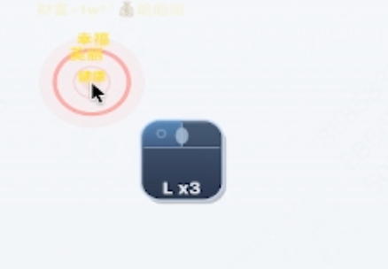
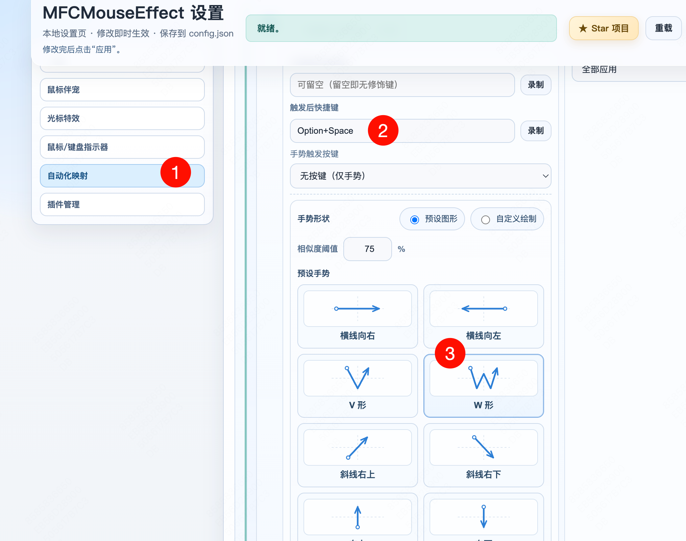
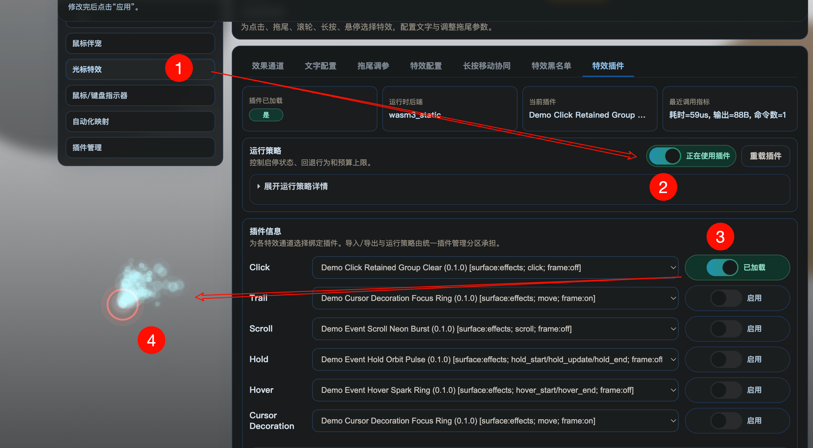
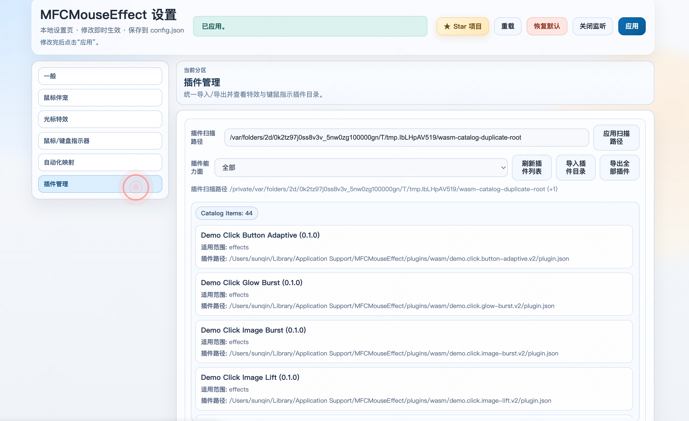
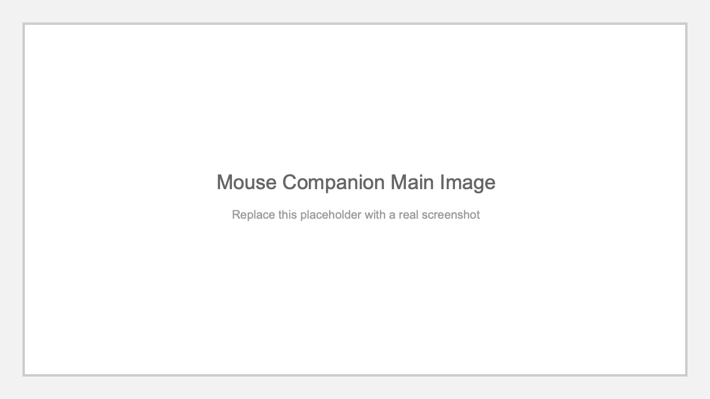

# MFCMouseEffect

<p align="center">
  
</p>

<p align="center">
  <a href="https://github.com/sqmw/MFCMouseEffect/stargazers"></a>
  <a href="https://github.com/sqmw/MFCMouseEffect/releases/latest"></a>
  <a href="https://github.com/sqmw/MFCMouseEffect/blob/main/LICENSE"></a>
  
</p>

<p align="center">
  A cross-platform engine for desktop input feedback, input visualization, automation mapping, and WASM-powered extensibility.
</p>

<p align="center">
  <a href="https://github.com/sqmw/MFCMouseEffect">Star</a> ·
  <a href="https://github.com/sqmw/MFCMouseEffect/issues">Issues</a> ·
  <a href="https://github.com/sqmw/MFCMouseEffect/releases">Releases</a> ·
  <a href="./docs/README.md">Docs</a>
</p>

**[🇨🇳 中文](README.md)** | **🇬🇧 English**

---

## Why This Project Stands Out

`MFCMouseEffect` is not just a mouse-click effect app.

It is evolving into a full desktop interaction-feedback platform with:
- mouse effects: `click / trail / scroll / hold / hover`
- cursor decoration: native and WASM-backed decoration lanes
- input indicator: mouse, wheel, and keyboard visualization
- automation mapping: mouse actions and gestures to shortcut injection
- WASM plugin runtime: separate `effects` and `indicator` surfaces
- shared Web settings UI: cross-platform, observable, and testable
- Mouse Companion: plugin-first desktop companion direction

This project is a great fit if you care about:
- making tutorials, demos, and screen recordings more expressive
- building desktop interaction feedback beyond a few hardcoded animations
- adding bounded, debuggable WASM extensibility inside a C++ host
- maintaining long-term cross-platform desktop architecture across Windows and macOS

## Highlights

- Host-owned rendering boundary: plugins compute logic, the host controls rendering and resources
- Shared semantics and settings flows across Windows and macOS
- WebSettings, diagnostics, regression scripts, and self-checks were designed together
- Native built-ins, plugin lanes, and fallback paths can coexist cleanly
- Clear layering across Core, Platform, Server, WebUI, Tools, and Docs

## Main Visuals

| Feature | Main Image | Feature | Main Image |
| :--- | :--- | :--- | :--- |
| Cursor Effects |  | Cursor Decoration |  |
| Input Indicator |  | Automation Mapping |  |
| WASM Plugin Runtime |  | Plugin Management |  |
| Mouse Companion |  | Shared WebSettings |  |

<details>
<summary>Feature Overview and Detail Images (expand)</summary>

## Feature Overview

### 1. Cursor Effects

Five core interaction lanes are available:
- `click`
- `trail`
- `scroll`
- `hold`
- `hover`

Why it matters:
- these are separate capability lanes, not just cosmetic variants of one effect
- type normalization and config mapping are continuously aligned across Windows and macOS
- settings, tuning, and diagnostics are exposed through WebSettings
- parts of the effect stack can be handed off to WASM plugins

### 2. Cursor Decoration

The project also has a dedicated cursor-decoration layer:
- built-in `ring / orb` decoration
- additive lane independent from the five main effect lanes
- can run as native fallback or a dedicated `cursor_decoration` WASM lane
- integrated with blacklist policy, fallback control, and plugin state

### 3. Input Indicator

Input indicator support includes:
- mouse left / right / middle click feedback
- wheel direction and streak labels such as `W+ x2`
- keyboard labels and combos such as `Cmd+Tab`
- relative / absolute positioning
- multi-monitor targeting and offsets
- native fallback and WASM indicator routing

### 4. Automation Mapping

Automation mapping is a real product surface, not a side feature:
- mouse button and wheel mappings to shortcuts
- drag gesture recognition with direction chains such as `up_right`
- configurable trigger button, sample step, stroke threshold, and max segments
- app-scope matching and deterministic priority behavior
- draw-and-save gesture flow plus self-check and regression coverage

### 5. WASM Plugin Runtime

This is one of the strongest differentiators of the project:
- separate `effects` and `indicator` surfaces
- manifest load, reload, import, and export flows
- budget control, command validation, fallback, and machine-readable diagnostics
- transient and retained rendering semantics
- ABI documentation and a bundled plugin template

Current command coverage already includes high-value primitives such as:
- `spawn_text`
- `spawn_image`
- `spawn_pulse`
- `spawn_polyline`
- `spawn_path_stroke`
- `spawn_path_fill`
- `spawn_ribbon_strip`
- `spawn_glow_batch`
- `spawn_sprite_batch`
- `spawn_quad_batch`
- retained emitter / trail / quad-field / group primitives

### 6. Plugin Management

The repo already has a dedicated plugin-management surface:
- unified `Plugin Management` section
- policy binding for effect lanes, indicator lanes, and cursor-decoration lanes
- manifest path, enabled-state, failure-state, and fallback visibility
- apply flow reflects real backend state instead of only mutating a form

### Plugin Quick Start

Plugins are a first-class feature. Start here:
- Template: `examples/wasm-plugin-template/README.md`
- Core doc: `docs/architecture/custom-effects-wasm-route.md`
- ABI spec: `docs/architecture/wasm-plugin-abi-v3-design.md`
- Load path: WebSettings `Plugin Management` -> choose manifest -> Apply

<details>
<summary>More guidance (expand)</summary>

- Pick the correct surface: `effects` or `indicator`
- If Apply reverts, check manifest path and load status first
- WebSettings shows diagnostics and fallback state for quick triage

</details>

### 7. Mouse Companion

`Mouse Companion` is one of the most visible active feature directions:
- plugin-first route for long-term extensibility
- macOS currently has a Phase1 visual host
- Windows is on Phase1.5 with renderer seams and runtime diagnostics
- the goal is a sustainable companion architecture, not a one-off pet demo

### 8. Shared WebSettings

The current settings UI is organized around focused product areas:
- `General`
- `Mouse Companion`
- `Cursor Effects`
- `Input Indicator`
- `Automation Mapping`
- `Plugin Management`

Benefits:
- cleaner capability boundaries
- backend-state-driven apply behavior
- easier platform reuse, debugging, and future expansion

## Preview And Image Placeholders

The structure below is ready for later screenshot replacement.

### Current Visuals

| Module | Preview | Module | Preview |
| :--- | :--- | :--- | :--- |
| Settings page |  | Click effect |  |
| Trail effect |  | Scroll effect |  |
| Hold effect |  | Hover effect |  |

<details>
<summary>More Detail Images (placeholders, expandable)</summary>

| Scene | Detail Image | Scene | Detail Image |
| :--- | :--- | :--- | :--- |
| Input Indicator |  | Automation Mapping |  |
| WASM Runtime |  | Plugin Management |  |
| Cursor Decoration |  | Mouse Companion |  |

</details>

</details>

## Platform Status

| Platform | Status | Notes |
| :--- | :--- | :--- |
| Windows 10+ | Stable mainline | Most complete capability set, regression compatibility preserved |
| macOS | Active mainline | Current priority lane for effects, indicator, automation, and WASM |
| Linux | Follow lane | Compile gate and contract coverage focused |

> Current project priority is `macOS mainline first`, while keeping Windows behavior regression-free.

## Quick Start

### Windows

Recommended path:
1. Open `MFCMouseEffect.slnx` in `Visual Studio 2026`
2. Use `Release | x64` by default
3. Run `x64/Release/MFCMouseEffect.exe`

You can also use the wrapper commands:

```powershell
.\mfx.cmd build
.\mfx.cmd build --shipping
.\mfx.cmd build --gpu
.\mfx.cmd package
```

Notes:
- `build` defaults to `Release | x64 | no-gpu`
- `build --shipping` creates a leaner delivery build
- `build --gpu` enables the Windows GPU hold runtime build
- `package` generates the installer

### macOS

```bash
# Build and run the core host
./mfx run

# Run without rebuilding core/WebUI
./mfx run-no-build

# Fast manual validation with auto stop
./mfx run-no-build --seconds 30

# Effects self-check
./mfx effects

# Recommended daily regression
./mfx verify-effects

# Full POSIX regression suite
./mfx verify-full

# Packaging
./mfx package
./mfx package-no-build
```

<details>
<summary>Important Notes And FAQ (expand)</summary>

## Important Notes And FAQ

This section is intentionally front-loaded to reduce install and first-run friction.

### 1. Why do effects or automation not work on macOS?

Check system permissions first:
- `Accessibility`
- `Input Monitoring`

The macOS runtime depends on those permissions for global input capture.  
When permissions are missing, the runtime can degrade gracefully and recover after the permissions are restored.

### 2. Why is Windows GPU support not enabled by default?

That is an intentional project policy:
- default is `--no-gpu`
- it is more stable for the common path
- it avoids extra runtime payload by default
- use `./mfx build --gpu` only when you explicitly want that route

### 3. Why is `Shipping` different from normal `Release`?

`Shipping` keeps the main runtime and WebUI, but trims deep testing and heavy diagnostics:
- no full `/api/test` deep test surface
- better for delivery
- not the best target for deepest runtime proof workflows

### 4. Is Linux a full end-user platform today?

Not yet.

Linux currently follows the project mainly through:
- compile success
- contract coverage
- structural alignment with the mainline architecture

For the best experience, prefer Windows or macOS.

### 5. Why does WebSettings revert a value after Apply or refresh?

Many settings are backend-state-driven.  
If the backend binding did not actually succeed, the UI will reconcile back to the real runtime state instead of pretending the apply succeeded.

Typical things to check:
- manifest path validity
- whether the target lane is enabled
- platform support for that route
- fallback state and plugin load failures

### 6. Can WASM plugins directly control host rendering and windows?

No.

This is one of the core architecture boundaries:
- plugins compute logic
- the host owns rendering execution, budget checks, fallback, and resources

That constraint is deliberate and central to the project's long-term design.

### 7. Are there any macOS packaging caveats?

Yes:
- current macOS packages are unsigned
- Gatekeeper may block first launch
- users may need Finder `Open` on first run
- notarization is not part of the current packaging path yet

</details>

<details>
<summary>Repository Structure (expand)</summary>

## Repository Structure

```text
MFCMouseEffect/
├── MFCMouseEffect/
│   ├── MouseFx/                 # Core engine: effects, automation, wasm, diagnostics, server
│   ├── Platform/                # Windows / macOS / Linux implementations
│   ├── WebUIWorkspace/          # Svelte settings UI source
│   ├── Runtime/                 # Runtime resources and dependencies
│   ├── Assets/                  # Companion and visual assets
│   └── WasmRuntimeBridge/       # WASM runtime bridge layer
├── tools/
│   ├── platform/regression/     # Regression scripts
│   ├── platform/manual/         # Manual and self-check helpers
│   └── docs/                    # Doc routing and doc-governance scripts
├── docs/                        # Architecture, roadmap, workflow, issue docs
├── examples/                    # Examples and templates
└── mfx / mfx.cmd                # Preferred command entrypoints
```

### Structural strengths

- `MouseFx/Core` owns semantics and reusable capability contracts
- `Platform/windows`, `Platform/macos`, and `Platform/linux` keep platform code separated
- `MouseFx/Server` plus `WebUIWorkspace` form a clear settings-server boundary
- `tools/platform/regression` and `tools/platform/manual` make the project verifiable
- docs are maintained as part of the engineering system, not as an afterthought

</details>

<details>
<summary>Regression And Self-Check Entry Points (expand)</summary>

## Regression And Self-Check Entry Points

```bash
# Full POSIX suite
./tools/platform/regression/run-posix-regression-suite.sh --platform auto

# Effects-focused suite
./tools/platform/regression/run-posix-effects-regression-suite.sh --platform auto

# Automation contract suite
./tools/platform/regression/run-posix-core-automation-contract-regression.sh --platform auto

# WASM-focused suite
./tools/platform/regression/run-posix-wasm-regression-suite.sh --platform auto
```

```bash
# macOS WebSettings manual runner
./tools/platform/manual/run-macos-core-websettings-manual.sh --auto-stop-seconds 60

# macOS effects parity self-check
./tools/platform/manual/run-macos-effects-type-parity-selfcheck.sh --skip-build

# macOS automation injection self-check
./tools/platform/manual/run-macos-automation-injection-selfcheck.sh --skip-build

# macOS WASM runtime self-check
./tools/platform/manual/run-macos-wasm-runtime-selfcheck.sh --skip-build
```

</details>

<details>
<summary>Documentation (expand)</summary>

## Documentation

- Docs overview: [docs/README.md](./docs/README.md)
- Chinese docs index: [docs/README.zh-CN.md](./docs/README.zh-CN.md)
- Current active context: [docs/agent-context/current.md](./docs/agent-context/current.md)
- macOS mainline snapshot: [docs/refactoring/phase-roadmap-macos-m1-status.md](./docs/refactoring/phase-roadmap-macos-m1-status.md)
- P2 capability router: [docs/agent-context/p2-capability-index.md](./docs/agent-context/p2-capability-index.md)

</details>

<details>
<summary>Contributing (expand)</summary>

## Contributing

Issues, ideas, suggestions, and pull requests are all welcome.

For larger features, architecture changes, or behavior changes across platforms, it is best to align first before implementation so work does not split across conflicting directions.

Recommended flow:
- open an [Issue](https://github.com/sqmw/MFCMouseEffect/issues)
- discuss the change briefly
- then send a PR
- for larger collaboration or architecture topics, email first

Contact:
- `ksun22515@gmail.com`

Good contribution areas:
- new visual effects and styles
- WebSettings UX improvements
- WASM plugin samples and tooling
- Windows and macOS behavior alignment
- docs, testing, self-checks, and regression tooling

</details>

## License

This project is released under the [MIT License](./LICENSE).

You are free to use, modify, and distribute it under the license terms.

---

<p align="center"><b>If it helps, please <a href="https://github.com/sqmw/MFCMouseEffect">star ⭐</a> and share feedback in Issues/Discussions.</b></p>
