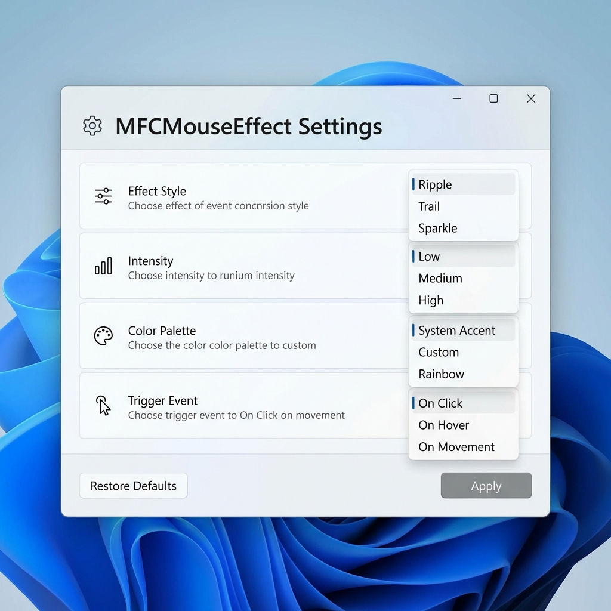

# MFCMouseEffect

  

[English](#english) | [简体中文](#简体中文)

---

## MFCMouseEffect (English)

**MFCMouseEffect** is a lightweight, high-performance Windows desktop enhancement tool designed to provide real-time visual feedback (ripples, particle trails, text effects, etc.) to elevate your interaction experience.

### 🌟 Key Features
- **Various Click Effects**: Support for ripple animations, random floating text, click bursts, and more.
- **Dynamic Mouse Trails**: Elegant particle flows following mouse movement with various color themes (e.g., Rainbow, Aurora).
- **Scroll & Hover Feedback**: Delicate visual guidance not just for clicks, but also for wheel scrolling and mouse hovering.
- **Extreme Performance**: Built with C++/MFC and utilizing GDI+ for hardware-accelerated rendering, ensuring low CPU and memory usage.
- **Process Singleton & Trayized**: Ensures a single instance automatically and supports running in the system tray.

### 📸 Showcase of Effects / 特效展示

  
   
  <em>Customizable Settings / 可定制的设置界面</em>

  
  
  
   
  
  
   
  <em>From left to right: Click Ripple, Particle Trail, Scroll UI, Long Press, and Hover Glow.</em>
   
  <em>从左至右：点击波纹、粒子拖尾、滚动效果、长按反馈、悬停发光。</em>

### 🎨 Themes & Customization / 主题与自定义
You can easily switch between different visual themes (e.g., Rainbow, Aurora, Neon) in the settings window. Each effect can be independently toggled and configured to match your personal style.

您可以在设置窗口中轻松切换不同的视觉主题（如彩虹、极光、霓虹等）。每种特效都可以独立开启或关闭，并根据您的个人喜好进行配置。

---

## MFCMouseEffect (简体中文)

**MFCMouseEffect** 是一款轻量级、高性能的 Windows 桌面增强工具，旨在通过实时视觉反馈（波纹、粒子轨迹、文字特效等）提升您的交互体验。

### 🌟 核心特性
- **多种点击特效**：支持波纹动画、随机文字飘浮、点击爆破等多种点击反馈。
- **动态鼠标拖尾**：优雅的粒子流随鼠标移动，支持多种颜色主题（如彩虹、极光等）。
- **滚动与悬浮反馈**：不仅是点击，滚动滚轮和鼠标悬浮时也提供细腻的视觉指引。
- **极致性能**：基于 C++/MFC 开发，利用 GDI+ 进行硬件加速绘制，低 CPU 和内存消耗。
- **进程单例与托盘化**：自动确保单实例运行，支持系统托盘后台运行。

### 📸 视觉展示
请参阅上方的 [特效展示](#showcase-of-effects-特效展示) 章节。

---

## 🛠 Installation & Usage / 安装与使用

### Build / 编译构建
1. Open `MFCMouseEffect.sln` with Visual Studio 2022.
2. Select `Release | x64` configuration.
3. Run `Build -> Rebuild Solution`.
4. Run `x64/Release/MFCMouseEffect.exe`.

### Installer / 安装包
Use our [Inno Setup Script](file:///f:/language/cpp/code/MFCMouseEffect/Install/MFCMouseEffect.iss) to build a professional installer.
使用配套的 [Inno Setup 脚本](file:///f:/language/cpp/code/MFCMouseEffect/Install/MFCMouseEffect.iss) 创建安装包。

---

## 📂 Structure / 项目结构
- **MFCMouseEffect/**: UI & App logic.
- **MouseFx/**: Core effect engine.
- **docs/**: Documentation ([UI Refinement](file:///f:/language/cpp/code/MFCMouseEffect/docs/ui_refinement.md), [Implementation](file:///f:/language/cpp/code/MFCMouseEffect/docs/singleton_implementation.md)).
- **Install/**: Inno Setup scripts.

---

## ⚖️ License
[MIT License](./LICENSE)

---
*Powered by Antigravity - 为交互赋予灵魂。*
